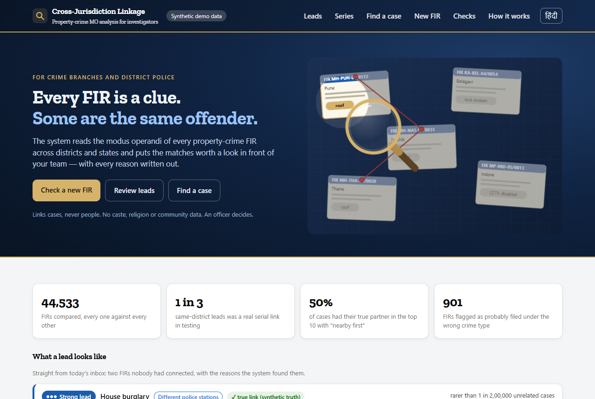
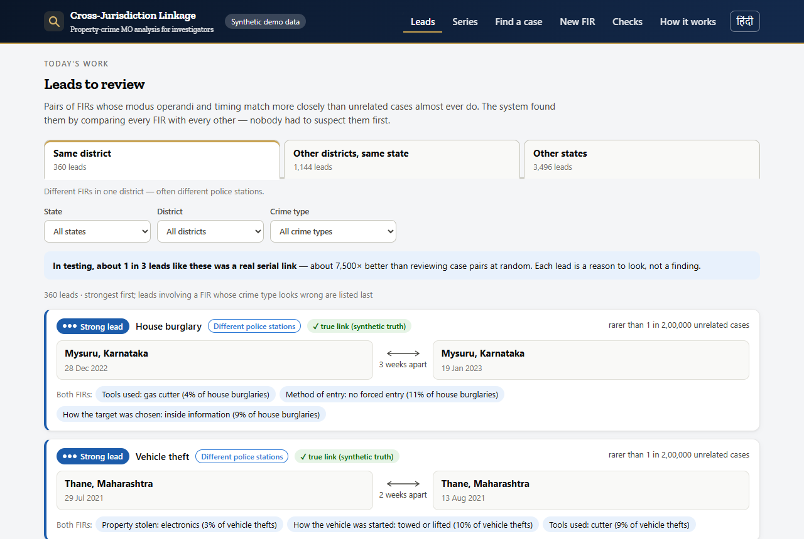
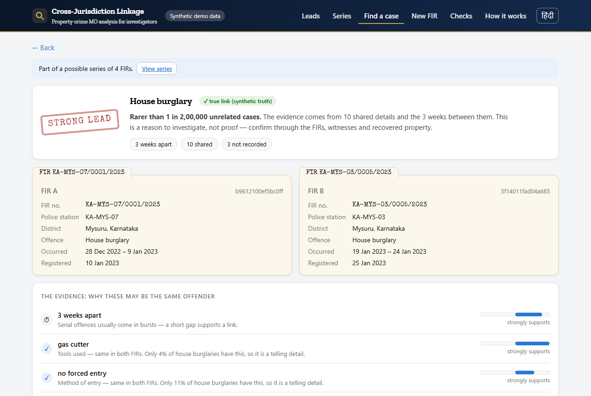
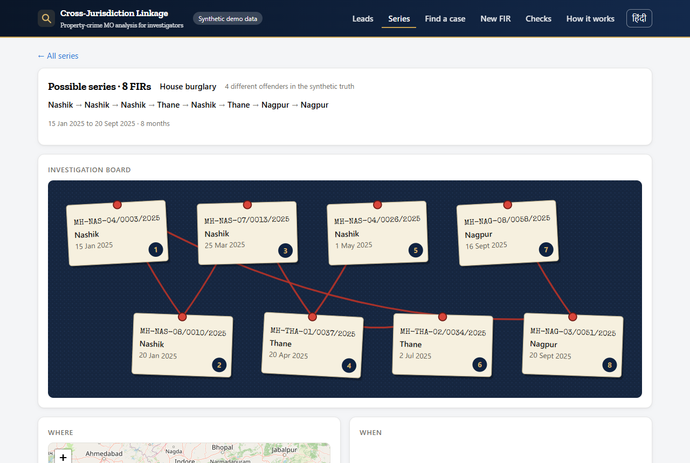
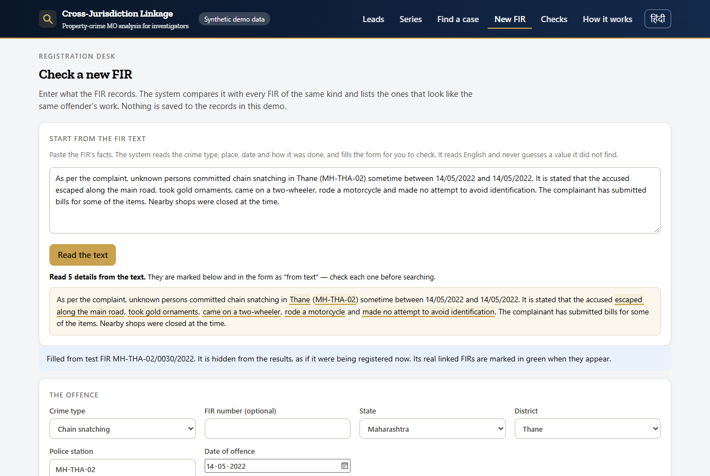

# Cross-jurisdiction crime linkage

Property crimes are recorded FIR by FIR, station by station. A serial offender's
cases therefore sit in different registers, often in different districts or
states, and nothing compares them. This system compares the **modus operandi**
of every property-crime FIR with every other one, ranks the pairs that look
like the same offender, and gives an analyst the reasons in plain language.

It never names a person and never claims a link. It narrows ~15,000 FIRs to ten
worth reading, and an officer decides.

**Live demo:** https://56z73fanvpxorv5dmkbc5d2kru0vmkqz.lambda-url.ap-south-1.on.aws/
— synthetic data, English / हिंदी, demo mode marks the synthetic ground truth
so you can see when it is right and when it is not.



| | |
|---|---|
| **Corpus** | 44,533 synthetic FIRs · 4 states · 20 districts · 5 property-crime types |
| **Ranking** | a true linked FIR is in the top 10 for **27.7%** of cases (**50.2%** with "nearby first") |
| **Leads found unprompted** | same-district lane: about **1 in 3** is a real serial link (~7,500× chance) |
| **Runs on** | one AWS Lambda + a Function URL + two DynamoDB tables — free tier, ~$0/month |
| **Read the numbers** | [FINDINGS.md](FINDINGS.md) — every figure, its method, and the ones that failed |

**Contents** · [The gap](#the-gap) · [What it does](#what-it-does) ·
[Results](#results-honestly) · [Architecture](#architecture) ·
[The model](#the-model-in-detail) · [Trade-offs](#design-decisions-and-trade-offs) ·
[Limits](#limits) · [Reproduce](#reproduce-everything) · [Deploy](#deploy-aws-free-tier) ·
[Repo map](#repo-map)

## The gap

CCTNS and ICJS already move FIR data between states. Cri-MAC already lets an
officer search it. Both assume somebody already suspects a link — a name, a
vehicle number, a tip. Nothing computes *"this burglary in Mysuru resembles
that one three weeks later in the next district, filed at another station."*

**The pipes exist; the inference doesn't.** That inference is this repo.

## What it does

### 1. A leads inbox nobody had to ask for

Every FIR is scored against every other FIR of its type. The strongest mutual
matches become leads, sorted into three lanes by where the two FIRs are, each
lane carrying its own measured record.



### 2. A side-by-side dossier with the reasons written out

Strength is stated as rarity — *"rarer than 1 in 2,00,000 unrelated cases look
this alike"* — never as a probability. Every reason is listed: the time gap,
each shared habit with how common it is, what differs, what was not recorded,
how distinctive the two FIRs are. Officers mark **Linked / Needs investigation /
Not linked**; every lookup and decision is logged.



### 3. Possible series, on an investigation board

Groups of FIRs chained only by links strong enough to hold, drawn as case files
on red string, with a map and a timeline.



### 4. Check a new FIR — paste the text, get the matches

Paste what the FIR says. A phrase reader pulls out the crime type, place, date
and MO (no language model, ~10 ms), fills the form for the officer to check,
and the FIR is scored against every FIR of its type exactly as a stored one
would be. Nothing is written to the records in the demo.



### 5. Crime-type checks

901 FIRs whose MO reads like the other burglary type. 98% of them really are
misfiled. A misfiled FIR is compared with the wrong pool, so its real links are
invisible — and its unusual-for-this-pool details manufacture false leads.

## Results, honestly

Held-out **test offenders** (split by offender, never by case), each query
ranked against **every** FIR in its pool — no blocking, so "top 10 of 15,482"
is literal. 1,318 same-type queries, 1,005 cross-type.

| ranking | hit@10 | recall@10 | PR-AUC | cross-state partner in top 10 |
|---|---|---|---|---|
| MO fields only | 0.128 | 0.062 | 0.041 | — |
| \+ time between offences | 0.235 | 0.120 | 0.083 | 16 / 495 |
| \+ distinctiveness, gaps read from FIR text — **default** | **0.277** | 0.139 | 0.091 | **24 / 495** |
| \+ place — **"nearby first"**, an officer's choice | **0.502** | 0.281 | 0.187 | 2 / 495 |
| cross-type (different offence, personal habits only) | 0.038 | 0.017 | 0.008 | — |

Per pool, default ranking: house burglary 0.34 (12,564 candidates),
commercial 0.46 (5,032), vehicle theft 0.19 (15,482), snatching 0.25 (8,006),
ATM 0.40 (3,444).

**Leads found with nobody asking** (estimated for offenders the scorer never
saw — see the correction note below):

| lane | leads | real links | vs picking pairs at random |
|---|---|---|---|
| same district | 360 | **28.7%** (about 1 in 3) | ~7,500× |
| other district, same state | 1,144 | 6.0% (about 1 in 17) | ~1,600× |
| other states | 3,496 | ~0 (5 real among all offenders) | shown, labelled low confidence |

A random same-type pair is a real link 1 in 25,942.

**Other outputs:** 134 possible series (77 spanning districts; about 1 in 5 FIR
pairs inside one are the same offender). 901 crime-type flags at 97.7%
precision, catching 92.8% of all misfiled FIRs. The FIR-text reader gets the
crime type and date right 100% of the time and its MO values agree with the
record ~100% / with the generator's truth 92.8%.

**Accuracy is the wrong metric.** A true link is ~1 in 26,000 pairs, so "never
linked" scores 99.996% accurate. This is a ranker; the question is whether an
offender's other crimes surface near the top.

> **A correction worth reading.** An earlier version of this README reported
> 61% for the same-district lane. That number counted only leads whose *both*
> FIRs came from held-out offenders — a filter true pairs survive ~4× more
> often than false ones, inflating the odds. The figures above scale held-out
> hits by the held-out share of all true pairs. [FINDINGS §11](FINDINGS.md).

## Architecture

Two halves: a **local pipeline** that produces one immutable bundle, and a
**stateless service** that answers from it.

```
 config/*.yaml ─┐
                ├─ linkage.generate ─→ data/final_sharing1/{feeds,truth}      synthetic corpus + ground truth
 adapters/*.yaml┘                            │
                                             ▼
                              linkage.normalise  ──→ *_normalised.parquet     one canonical schema, per-state adapters
                                             │
                        scripts/fill_from_text.py  ──→ *_textfilled.parquet   blank MO read from the FIR's own text
                                             │
     ┌───────────────────────────────────────┼───────────────────────────────────────┐
     ▼                                       ▼                                       ▼
 linkage.train                         linkage.tune                          linkage.evaluate
 FS weights + logistic                 ranking strengths on                  held-out test offenders,
 correction + time bits                CALIB offenders                       full-pool, no blocking
     └───────────────── model/weights.json ──┴───────────────────────────────────────┘
                                             │
                                    linkage.bundle  ──→ data/serve/            ~10 MB, read-only
                                    (leads, series, checks, rarity tables,
                                     encoded codes, phrases, display records)
                                             │
                          scripts/package_lambda.py ─→ build/app + numpy layer
                                             ▼
        AWS Lambda (python3.12, arm64, 1024 MB)  ── Function URL ──→  ui/index.html + /api/*
                    │                                                  one file, vanilla JS, no build step
                    └── DynamoDB: feedback (pair_id) · audit (actor_id)
```

**Why a bundle.** Everything the service needs is computed offline and shipped
inside the deployment package: encoded MO codes (`codes.npz`, 1.3 MB), display
records (`cases.json.gz`, 6.2 MB), leads, series, checks, the rarity tables and
the phrase dictionary. No database read on the hot path, no cold-start model
load, nothing to keep in sync. Rebuilding the bundle is the deployment.

**Request path.** `GET /` returns the single-file UI. `/api/*` runs the same
`handlers/api.py` locally (`scripts/serve_local.py`) and on Lambda (Function
URL, payload v2), so what works locally is what deploys. Scoring one FIR
against a whole pool is one vectorised numpy pass: **10–50 ms locally, 0.2–0.4 s
round trip to Mumbai** including cold JSON.

| endpoint | what it does |
|---|---|
| `/meta` | corpus context, model summary, demo cases, measured quality |
| `/leads` | the inbox, filtered by lane, state, district, crime type |
| `/cases/{id}` · `/cases/{id}/links?rank=` | one FIR; its shortlist in either ranking |
| `/pairs/{a}__{b}?rank=` | the dossier: both records, every reason, strength |
| `/series` · `/series/{id}` | possible series and their links |
| `/checks` | FIRs that look filed under the wrong crime type |
| `/form` · `/form/sample` · `/read` · `/match` | the new-FIR desk: field spec, a test FIR, read text, match |
| `/links/{a}__{b}/feedback` | GET the decisions on a pair, POST a new one |

**Cost.** Lambda free tier covers the demo's traffic; DynamoDB runs at
provisioned 1/1 (always-free); logs expire in 7 days. No API Gateway, no
Bedrock, no KMS, no NAT. About $0/month.

## The model in detail

**1. Evidence per field (Fellegi–Sunter).** For a pair of FIRs, each MO field
contributes `log2(m/u)` when the values agree and `log2((1−m)/(1−u))` when they
differ, where `u` is how often that value appears in the pool and `m` how often
the same offender repeats it. `m` comes from a single per-field concentration
`α` fitted on training offenders: `m_v = (α·p_v + 1)/(α + 1)`. Rare agreements
therefore count far more than common ones — "entered through the roof" is worth
many times "broke the lock". Missing values contribute exactly zero.

**2. A logistic correction.** Fields are not independent (`exit_mode` copies
`approach_mode`), so a logistic regression on the per-field bits learns one
coefficient per field, trained on same-offender pairs vs random pairs. Scoring
is `coef · bits / ln2` in pure numpy — sklearn never ships to Lambda.

**3. Time between offences.** Serial offending is bursty, so the gap carries
evidence: bins at 30/90/180/365/730 days, weighted
`log2 P(gap | same offender) / P(gap | unrelated)`. Under 30 days ≈ +3 bits;
over two years ≈ −4. This roughly doubled same-type linkage — and it is also
the assumption our generator encodes, so it must be re-measured on real FIRs.

**4. Distinctiveness (default ranking).** Some FIRs have such generic MO that
they sit near the top of everyone's list. Each FIR's `r` = mean of its own top-10
evidence; a pair moves by `−β·((r_a + r_b)/2 − mean r)`. Label-free, costs
nothing in cross-state recall, and shows up as a readable reason.

**5. Place ("nearby first", opt-in).** `log2 P(where | same offender) /
P(where | random pair)` over same station / same district / same state / another
state: +3.2, +3.4, +0.5, −2.2 bits. It nearly doubles hit@10 and buries
cross-state links, so it is never the default.

**6. Strength as rarity, never probability.** For each pool the bundle scores
200,000 random unrelated pairs and keeps the distribution. A lead's strength is
"about 1 in N unrelated pairs look this alike", measured, with tiers at 1 in
10,000 (strong) and 1 in 1,000 (worth checking). A true link carries a median
+1.8 to +3.3 bits against a prior of −12 to −17 bits: the evidence never clears
the prior on its own, which is exactly why a human decides.

**7. Derived products.** *Leads*: every case's top-3 mutual matches, rarer than
1 in 1,000, sorted into lanes. *Series*: connected groups joined only by mutual
links rarer than 1 in 10,000 within a district or 1 in 200,000 across districts
of one state — plain connected components chain into 7,000-FIR blobs, so the
threshold is the product. *Checks*: for FIRs in a family with more than one type,
`log2` of how much likelier the recorded values are under the other type.

**8. Reading FIR text.** A phrase dictionary built from each state's own wording
plus everyday variants, matched longest-first with each stretch of text claimed
once ("fled on foot" is an escape; its "on foot" is not "no vehicle"). It fills
blank MO cells offline (29% of cells were blank; Telangana records MO only as
free text) and powers the paste-the-FIR desk. Filled values carry provenance
`text_read` and are labelled "from FIR text" in the UI.

## Design decisions and trade-offs

| decision | why | what it costs |
|---|---|---|
| **Location-blind by default**, place only as an officer's choice | a location-aware ranker buries exactly the cross-jurisdiction links the project exists for (cross-state partners found: 24 → 2 of 495) | the default is ~half as precise as it could be; the switch states both numbers |
| **No blocking, score the full pool** | filtering by a feature you also score is the same operation done worse; narrative embeddings were measured and matched on *place*, retrieving 0 of 1,094 cross-state partners | rebuilding every lead, series and check takes ~3 min offline; a single request is unaffected |
| **Rarity, not probability** | a true link posteriors at ~0.3%; showing that reads as "broken", and a strong-looking percentage invites false certainty | analysts must learn "1 in N unrelated pairs", which the UI explains inline |
| **Separate pools per crime type** | MO fields differ by offence; mixing them dilutes both | cross-type links only compare personal habits, and stay weak (3.8%) |
| **Synthetic corpus** | no real FIR corpus is available, and publishing one would be unethical | every number is a property of our generator until re-measured; said everywhere |
| **Phrase reader, not an LLM, on the hot path** | Bedrock was unavailable on this account; a local Ollama run was measured and is ~4 h for one pass; phrases run in 10 ms with no invention | English only, and it inverts our own generator's wording — an upper bound |
| **Bundle inside the deployment package** | no database on the request path, no drift between model and data, cold start about a second | redeploy to change data; 56 MB package (limit 250 MB) |
| **Lambda + Function URL, no API Gateway** | free tier, no idle cost, one file to deploy | no Cognito sign-in: officer names are typed and marked unverified |
| **DynamoDB for feedback and audit only** | append-only, cheap, and keeps decisions out of the read-only bundle | no server-side aggregation of decisions yet |
| **One HTML file, no build step** | a judge (or a police IT cell) can read the whole client; nothing to compile | no component framework; the file is ~1,600 lines |
| **Ship "what failed" in the repo** | the discarded attempts are the honest part of the result | takes space in FINDINGS: hard negatives, series-aware re-ranking, two generator parameterisations |

## Limits

- **The data is synthetic.** The numbers show the method works on data built to
  resemble FIRs. They are not field performance.
- **Two gains are partly our own assumptions:** the time evidence (generator's
  bursty gaps) and the place term (generator's relocation model). Re-measure both.
- **The text reader starts from the phrases the narratives were written with.**
  On real FIRs — messier, often not in English — expect materially less.
- **Cross-state linkage is the honest weak spot:** the score can surface those
  pairs, but in testing almost none of the strong cross-state leads were real.
- **No person is identified.** No caste, religion or community field exists
  anywhere; personal details never enter matching; the output is always a pair
  of case numbers and reasons.
- **The demo URL is public and unauthenticated**, with synthetic data only.

## Reproduce everything

```bash
python -m linkage.config                      # check config/, list unfilled entries
python -m linkage.generate --seed 7 --cross-type-sharing 1 --out data/final_sharing1/
python -m linkage.normalise --feeds data/final_sharing1/feeds \
    --out data/final_sharing1_normalised.parquet --check data/final_sharing1/truth.parquet
python scripts/fill_from_text.py --out data/final_sharing1_textfilled.parquet
python -m linkage.train    --normalised data/final_sharing1_textfilled.parquet \
    --truth data/final_sharing1/truth.parquet --out model/weights.json
python -m linkage.tune     --normalised data/final_sharing1_textfilled.parquet \
    --truth data/final_sharing1/truth.parquet --weights model/weights.json --out model/weights.json
python -m linkage.evaluate --normalised data/final_sharing1_textfilled.parquet \
    --truth data/final_sharing1/truth.parquet --weights model/weights.json --out results/textfilled/eval.json
python scripts/textread_eval.py --out results/textread/eval.json
python -m linkage.bundle --out data/serve --with-ground-truth
python scripts/serve_local.py --demo            # http://127.0.0.1:8000
pytest -q                                       # 81 tests: invariants, API contract, undefined names
```

`--demo` marks synthetic ground-truth links; leave it off to see what an
analyst would. The sweep behind the honesty claims
(`repeat_rate × cross_type_sharing`) is `python -m linkage.sweep`.

## Deploy (AWS free tier)

```bash
aws login                                       # browser sign-in (incognito if you get a 400)
python -m linkage.bundle --out data/serve --with-ground-truth
python scripts/package_lambda.py                # stages build/app + a Linux arm64 numpy layer, then smoke-tests it
cd infra && sam build && sam deploy --stack-name linkage-demo --resolve-s3 \
    --capabilities CAPABILITY_IAM --region ap-south-1
```

The packager imports and calls the staged app before reporting success, so a
module left out of the package fails on your machine instead of as a 502.

## Repo map

```
linkage/           pure functions, no AWS imports
  schema.py        fields, crime types, families, tokens
  features.py      Fellegi-Sunter weights, encoding, time bins   (numpy only)
  score.py         inference from exported coefficients          (numpy only)
  rank.py          distinctiveness + place terms                 (numpy only)
  checks.py        crime-type check for one FIR
  textread.py      FIR text → MO fields (phrase dictionary)
  serve.py         shortlists, dossiers, strength                (what Lambda runs)
  train.py tune.py evaluate.py bundle.py                         local only
  generate/        synthetic corpus + six validators
handlers/          Lambda entry points (api.py, store.py) — boto3 lives here only
ui/index.html      the whole client: English/हिंदी, no build step
infra/template.yaml  SAM: Lambda + Function URL + two DynamoDB tables
scripts/           fill_from_text, package_lambda, serve_local, evaluations, plots
tests/             invariants, API contract, undefined-name check
FINDINGS.md        every measured number and how it was obtained
DEMO.md            3-minute demo script with the exact FIRs to click
TECHNICAL_SPEC.md  the original specification
DATASET.md         dataset card for the synthetic corpus
CLAUDE.md          working rules for this repo
```

## What's next

- Re-measure timing and place on real FIR data; both currently inherit the
  generator's assumptions.
- Score house and commercial burglaries in one family pool — measured at
  +8 points for finding the other type's partners, not yet shipped
  ([FINDINGS §14](FINDINGS.md)).
- Cognito sign-in through API Gateway, replacing typed officer names.
- Regional-language FIR text: the reader is English-only today.
- Feed confirmed and rejected links back into training.
