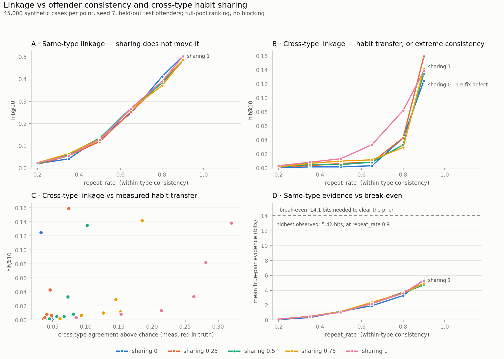

# Cross-jurisdiction crime linkage

Links property-crime cases across Indian state borders by behavioural
similarity, and hands a human analyst a ranked shortlist. It never identifies
a person, and it never claims a link — it ranks candidates.

CCTNS and ICJS already move the data between states. Cri-MAC lets an officer
search it, but only once somebody already suspects a link. Nobody computes
"this FIR in Nashik resembles that one in Indore from ten months ago." **The
pipes exist; the inference doesn't.**

**Live demo:** https://56z73fanvpxorv5dmkbc5d2kru0vmkqz.lambda-url.ap-south-1.on.aws/
(synthetic data; demo mode marks synthetic ground-truth links)

## Status

| Stage | State |
|---|---|
| Synthetic corpus generator + 6 validators | done |
| Adapters + normalisation (state feeds → canonical records) | done, exact on 44,533 of 44,533 records |
| Scorer: Fellegi-Sunter + logistic correction, evaluation by offender | done |
| repeat_rate × cross_type_sharing sweep | done, 30 points + 3-seed noise floor |
| MO extraction (local Ollama) and narrative embeddings (local e5) | done locally; Bedrock not available |
| Analyst UI + API | done, verified locally and live |
| AWS deploy, free tier: Lambda + Function URL + DynamoDB | **live** in ap-south-1 |
| Cognito login, Verified Permissions, PII table with KMS | not started — needs API Gateway, beyond free tier |

## Results, honestly

Measured on held-out **test offenders** (split by offender, never by case),
ranking each query against **every** case in its pool — no blocking, so a rank
is literally out of the whole pool. Corpus: 45,000 synthetic cases,
`repeat_rate` 0.5.

| | hit@10 | recall@10 | PR-AUC |
|---|---|---|---|
| same-type, default ranking (MO + time + distinctiveness) | **0.262** | 0.132 | 0.087 |
| same-type, "nearby first" (officer's choice, adds place) | **0.457** | 0.249 | 0.161 |
| same-type, MO + time evidence only | 0.235 | 0.120 | 0.083 |
| same-type, MO only | 0.128 | 0.062 | 0.041 |
| cross-type, MO + time | 0.029 | 0.015 | 0.008 |

"Nearby first" nearly doubles precision but finds a cross-state partner for
3 of 495 cases instead of 17, so the default stays location-blind and the
switch states both numbers ([FINDINGS §14](FINDINGS.md)).

Time roughly doubles same-type linkage — on synthetic data whose gaps we
generated to be bursty, so the size of that gain must be re-measured on real
FIRs ([FINDINGS §10](FINDINGS.md)).

**Leads inbox** (pairs found with nobody asking; rate estimated for offenders
the scorer never saw):

| where the two FIRs are | leads | real links |
|---|---|---|
| same district | 432 | about 1 in 4 (24.0%) |
| other districts, same state | 1,498 | about 1 in 29 (3.5%) |
| other states | 3,070 | ~0 — shown, labelled low confidence |

A random same-type pair is a real link 1 in 25,942, so the same-district lane
is ~6,200× better than chance. The score never uses location, so cross-state
matches can surface; most turn out to be coincidence, and the UI says so
([FINDINGS §11](FINDINGS.md), which also corrects an earlier, inflated
version of these numbers).

**Possible series** — groups of FIRs chained by strong same-state links, with
a map and a timeline: 197 series, 118 spanning districts; about 1 in 5 FIR
pairs inside a series are one offender, so each link is shown separately
([§12](FINDINGS.md)). **Crime-type checks** — FIRs whose MO reads like the
other burglary type: 714 flagged, 97% truly misfiled, 73% of all misfiled
FIRs found, with no labels ([§13](FINDINGS.md)).

**Accuracy is not the metric and would be misleading.** True links are ~1 in
50,000 pairs, so "no link" everywhere scores 99.998% accurate. This is a
ranker: the question is whether an offender's other crimes surface near the
top of an analyst's list. Typically a true partner lands in the top ~2% of the
pool; 26% of the time it reaches the top 10 out of ~15,000 (46% with "nearby first").

Evidence per link is small: the median true pair carries **+0.8 to +2.9 bits**
against a prior of −12 to −17 bits. The spec's +5.85 bit example is a *strong*
match (top 5–21% of same-type true pairs with time evidence), not a typical
one. The evidence alone cannot clear that prior — by design, the system ranks
and a human decides.

How much of this is the corpus rather than the method? That is what the sweep
answers: at `repeat_rate` 0.9 the same scorer reaches hit@10 0.502. No
published figure says how consistent real offenders are, so the result is the
curve, not a point.



**[FINDINGS.md](FINDINGS.md) is the source for every number here**, including
a generator defect found by measurement, two rejected parameterisations, and
why better LLM extraction would buy almost nothing (2.2 points).

## Try it locally

```bash
python -m linkage.bundle --out data/serve --with-ground-truth   # package the corpus for the API
python scripts/serve_local.py --demo                            # http://127.0.0.1:8000
```

The analyst view (English / हिंदी): a leads inbox split by where the two FIRs
are, each lane with its tested record; possible series on a map and timeline;
crime-type checks; search by FIR number, police station or district; a
case's ranked shortlist with a strength tier ("about 1 in 40,000 unrelated
cases look this alike") and the shared habits that drive it; and a
side-by-side comparison of two FIRs that lists every reason — timing, shared
habits and how common each is, differences, what was not recorded — with
Linked / Needs investigation / Not linked and a printable report. `/api/*` is served by
`handlers/api.py` — the same handler Lambda runs. `--demo` marks synthetic
ground-truth links; leave it off to see what an analyst would.

## Deploy (AWS free tier)

One Lambda serves the UI and the API through a Lambda Function URL; the case
bundle ships inside the package; feedback and audit go to DynamoDB at
always-free capacity. No API Gateway, no Bedrock, no KMS key — about $0/month
at demo traffic.

```bash
aws login                                  # browser sign-in (use an incognito window if you get a 400)
python -m linkage.bundle --out data/serve --with-ground-truth
python scripts/package_lambda.py           # stages build/app + a Linux numpy layer; no Docker needed
cd infra && sam build && sam deploy --stack-name linkage-demo --resolve-s3 --capabilities CAPABILITY_IAM --region ap-south-1
```

The URL is public with no login — fine for a demo of synthetic data. The
spec's Cognito login and Verified Permissions need API Gateway, which is the
upgrade path when it is needed.

## Run it

```bash
pip install -r requirements.txt
python -m linkage.config                     # config must print READY
pytest -q                                    # 14 invariants
python scripts/preflight.py                  # pre-deployment checks

python -m linkage.generate --seed 7 --n-cases 45000 --cross-type-sharing 1 --out data/mine/
python -m linkage.normalise --feeds data/mine/feeds --out data/mine_normalised.parquet --check data/mine/truth.parquet
python -m linkage.train    --normalised data/mine_normalised.parquet --truth data/mine/truth.parquet --out model/weights.json
python -m linkage.tune     --normalised data/mine_normalised.parquet --truth data/mine/truth.parquet --weights model/weights.json --out model/weights.json
python -m linkage.evaluate --normalised data/mine_normalised.parquet --truth data/mine/truth.parquet --weights model/weights.json --out results/mine.json
```

Two corpora are committed as the endpoints of the sharing sweep — see
[DATASET.md](DATASET.md).

## Layout

```
linkage/      schema, config, normalise, features, score, train, evaluate, sweep
  generate/   the synthetic corpus generator and its validators
adapters/     one YAML per state feed — the pipeline's only state knowledge
config/       marginals, loadings, states, corpus, vocab (+ how τ was chosen)
model/        exported weights.json: ~30 numbers per pool, pure-numpy inference
handlers/     Lambda entry points (boto3 lives here, never in linkage/)
infra/        SAM template
results/      committed results: pre/post fix, the sweep, preflight
tests/        invariants that must survive deployment work
```

`TECHNICAL_SPEC.md` is the full design. `CLAUDE.md` holds the rules that are
easy to break by accident.

## Ethics and limits

- **The corpus is synthetic.** Every number measures whether a model can
  invert this generator, not real-world performance.
- **No protected attributes.** No caste, religion or community fields — not in
  the schema, the generator or the model.
- **Personal data is walled off** from scoring by IAM and a separate KMS key,
  not by convention.
- **Positive-unlabelled:** unlabelled pairs are not confirmed non-links.
- **Cross-type is a candidate generator, not a link finder.** Keyword search
  on IPC sections cannot surface those pairs at all; this surfaces them weakly.
  That is the claim, and it is the one that holds.
